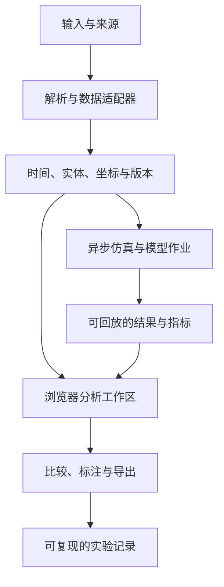

# Fieldwork 实施方案

## 1. 产品边界与入口

平台不包含个人简介。导航保持“场景库 / 实验室 / 方法与边界”，内容按问题组织。已做的人体、产业链、Crypto、自驾、仿真和汽车可视化是可复用的领域模块，不把它们包装成履历条目。

首页只把真正能在本站运行的能力标为“可运行”。每个场景有：目标问题、数据类型、引擎、运行环境、已知限制和可验证结果。尚未接入的引擎提供明确外链，不能通过同一个粒子效果冒充多个行业演示。

本轮提供一个平台基础版；完整生产平台按下列验收关卡推进。耗时是工作量估计，依赖数据、算力、资产授权和集成复杂度，不是交付承诺。

## 2. 信息架构

```text
/                       场景目录、筛选、可运行工具入口
/labs/braking           解析制动对比与结果导出
/labs/robot             平面机械臂 FK/IK
/labs/physics           Rapier 刚体实验
/labs/model             本地 GLB 检查
/methodology            假设、来源、真实性边界
/examples              原有地图与空间示例
/projects/[slug]        保留原有 11 个 URL
```

后续规划路由（当前未实现）：`/workspaces/[id]` 联动分析；`/datasets/[id]` 资产与版本；`/runs/[id]` 实验记录；`/compare/[id]` 运行对比；`/cases/[id]` 可复现问题与证据。先让匿名用户可打开公开样例、本地处理文件；只有需要保存私有数据、协作和计算资源时再接账户体系。

## 3. 同一底座，多个领域适配器



统一的是数据与交互协议，不强迫所有引擎使用一个渲染实现。

- **Web 外壳：** 保留当前 Next.js/React/TypeScript；按路由动态加载引擎，避免所有 WASM、地图和图表进入首页包。
- **空间：** Three.js 承担通用 3D、拾取、部件与交互；大地理场景用 CesiumJS；体数据/网格科学后处理用 VTK.js；3DGS 用 Spark。
- **分析：** 曲线保持 2D，实体关系用 Sigma.js，表与列式查询用 DuckDB-WASM/Arrow；计算较重的解析放 Worker。
- **记录：** 优先 MCAP，与 Rerun/Foxglove 的适配器解耦。Rerun 记录格式与 Viewer 版本须配套，不能假设跨版本永远可读。[版本提示](https://rerun.io/docs/getting-started/install-rerun/viewer)
- **重计算：** 独立 Python/容器作业运行 CARLA、Gazebo、MuJoCo、Isaac/Cosmos、训练和批量分析。CPU 与 GPU 队列分开；前端只提交配置、查看状态和消费结果。
- **存储：** 小数据优先浏览器本地；正式服务用对象存储保存大文件，PostgreSQL 保存索引、权限与来源。初期不用同时引入多个图数据库和任务系统。
- **实时：** 只读 bridge 连接 ROS；WebSocket 消费状态，WebRTC 处理低延迟视频。授权、Topic 白名单和速率限制在网关做，普通浏览器不直接访问机器人控制网络。

## 4. 最小公共协议

```ts
interface DatasetManifest {
  id: string;
  version: string;
  sha256: string;
  kind: "recorded" | "synthetic" | "generated";
  source: { title: string; url?: string; license: string; accessDate: string };
  clock: { unit: "ns"; epoch: string; domain: string };
  coordinates?: { frame: string; axes: string; handedness: "right" | "left"; unit: "m" };
  channels: { id: string; schema: string; encoding: string; frame?: string }[];
  assets: { uri: string; bytes: number; mime: string; sha256: string }[];
}
interface ExperimentManifest {
  id: string;
  sceneId: string;
  datasetVersions: string[];
  engine: { name: string; version: string; imageDigest?: string };
  seed?: number;
  parameters: Record<string, unknown>;
  status: "queued" | "running" | "succeeded" | "failed" | "cancelled";
  outputs: { uri: string; sha256: string; type: string }[];
  metrics: { name: string; value: number; unit: string; method: string }[];
}
```

正式协议中的纳秒值通过十进制字符串/BigInt 或 Arrow int64 传输，不用 JavaScript Number 存 epoch 纳秒。数据时钟和播放时钟分开；timestamp、TF、插值和未到达帧都有确定语义。`latest message` 不等于当前时间的正确消息。

前端协调器广播 `timeChanged`、`entitySelected`、`cameraChanged`、`filterChanged`、`annotationAdded` 等有类型事件。每个适配器提供 `load/query/seek/dispose`，并声明支持的格式、最大建议规模与异常状态。

## 5. 两条最应先做完整的旗舰工作流

### A. 自驾/机器人失败回放

1. 打开合法的小型 MCAP 示例或本地文件，显示通道与时间范围。
2. 同时显示点云、图像、TF、速度/转向；在时间轴选择异常事件。
3. 注入已知偏移（例如 100 ms 时钟差），显示投影与曲线变化；标明它是测试夹具。
4. 保存书签和视角，导出包含数据版本、时间窗与备注的结果。
5. 对同一输入运行第二个算法/参数版本，锁定时间与相机比较。

验收：不是播放一段视频，而是用户能找到预置问题、修改参数、复算并分享同一时刻。MCAP 解压、schema 解码、视频关键帧 seek、TF 时间插值、Range 请求错误都有测试。真实 ROS 控制不属于第一阶段。

### B. 机器人数据—策略—结果

1. 用 LeRobot episode 数据展示相机、关节状态、动作和任务描述。
2. 标记跳变/缺帧/失败片段，生成可导出的片段选择。
3. MuJoCo/Gazebo/Isaac 后台执行固定配置任务，记录接触和轨迹。
4. 在同一工作区比较策略版本；结论指向失败片段与配置。

验收：同一 seed/配置可重跑；成功率来自定义清楚的任务集合；不能以一条成功动画代表总体策略质量。学习策略推理、控制频率与物理时间步分别记录。

AI Agent trace 是第三个复用方向：将时间轴与事件对比用于模型调用、工具与检索，不把模型内部思考作为可观测数据。

## 6. 现有模块如何并入

| 模块 | 保留 | 最有价值的升级 | 进入统一平台的条件 |
|---|---|---|---|
| 人体 | 结构树、选中高亮、移动交互 | 关节运动、剖切与来源说明；教育用途 | 资产/术语/位置来源可追溯，不声称疾病诊断 |
| 产业链 | 实体关系与无限画布 | 证据、有效时间、实体消歧、假设冲击 | 每条关系都有出处与状态，未知覆盖率明确标注 |
| Crypto | 策略曲线与回测交互 | 成本归因、样本外窗口、成交约束、版本对比 | 数据时间/市场明确；资金费率、手续费与滑点口径可复算 |
| 自驾 | 点云、轨迹、相机 | 时间同步、场景事件、版本比较 | 真实示例可分发；支持明确 schema 与坐标约定 |
| 仿真 | 场景与状态 | 后台作业、seed、参数、结果记录 | 明确具体引擎、版本、求解假设与误差 |
| 汽车 | 3D 看车 | 部件树、官方配置、测量、驾驶视野与空间对比 | 车型 GLB 和资料授权；车型/年份不能靠外观推测 |

这些项目在其他仓库中的成熟度需逐个审计。本轮不宣称已迁移它们的后端、数据或全部功能，也不使用未知部署 URL 冒充平台集成。

## 7. 分期与验收关卡

| 阶段 | 预估工作量 | 交付 | 退出条件 |
|---|---|---|---|
| M0 本轮基础版 | 已落地，见状态文档 | 平台入口、24 场景目录、4 个独立实验室、官方引擎映射、研究与规划 | 构建、核心数学与物理测试通过；当前与规划状态明确 |
| M1 数据工作区 | 约 2–3 工程周 | MCAP/JSON 样例、时间轴、多视图、TF、实体选中、标注与导出 | 在固定样本中定位已知问题；内存和 seek 有测量；无主线程大文件阻塞 |
| M2 问题闭环 | 约 2–4 工程周 | 传感器对齐诊断、LeRobot 数据质检、A/B 比较 | 真实用户完成至少两个任务；可复现结果；确认最有价值的模板 |
| M3 仿真后台 | 约 3–5 工程周 | 先接一种原生仿真器，作业/日志/取消/预算、结果记录 | 同一版本配置可重跑；失败与超时可恢复；GPU 成本可计量 |
| M4 领域扩展 | 根据验证逐项估算 | 汽车、3DGS、AI trace、已有金融/人体模块的适配 | 每个模块独立通过数据/授权/效果/性能验收后上线 |

工作量基于已有熟练前端能力、小型可用数据与现成部署条件，阶段可有重叠，但不据此承诺固定总工期。没有数据或授权时，不把等待时间填成虚构进度。

## 8. 性能和产品指标

目标值必须以指定设备与样例测量后才对外宣传；以下是拟定验收目标，不是已测成绩。

- 固定普通笔记本 + 固定 50–100 MB 数据样例：首个可解释视图目标 3 秒内，已预取时间窗内 seek 目标 200 ms 内；首次网络读取另报。
- 3D 交互目标稳定 30 FPS；移动设备提供采样/LOD/分辨率降低与暂停；显示实际数据预算。
- 大文件索引/解码在 Worker；对象存储支持 Range；视频依赖关键帧索引，不靠全量下载冒充流式 seek。
- 有界缓存、typed arrays、transferable buffers，显式释放 geometry/material/texture/WASM world。
- 业务：任务完成率、根因定位正确率、到达证据的时间、成功导入第二份数据、复访与导出。
- 记录设备、浏览器、网络、数据规模、采样方法、冷/热缓存和版本，不只展示“百万点、60 FPS”口号。

## 9. 商业路径与成本边界

先验证“免费公开场景 + 本地文件工具”的复访；再评估私有工作区、团队标注、版本比较和仿真作业是否有付费需求。暂不预设售价或市场规模。

成本分开：静态站点与 CDN、大文件存储/下载、CPU 解析、GPU 仿真/推理、模型与数据许可。GPU 作业必须有队列、并发上限、超时、取消、预算与结果缓存；不能让访问首页触发付费推理。

安全边界与功能直接相关：本地 GLB 限制大小与外部资源；服务端导入 URL 做网络隔离与 SSRF 控制；ROS 首期只读；机器人控制需独立授权与急停机制；私有数据不写入公开示例。未经过复核的生成数据不用于宣称真实性能。
